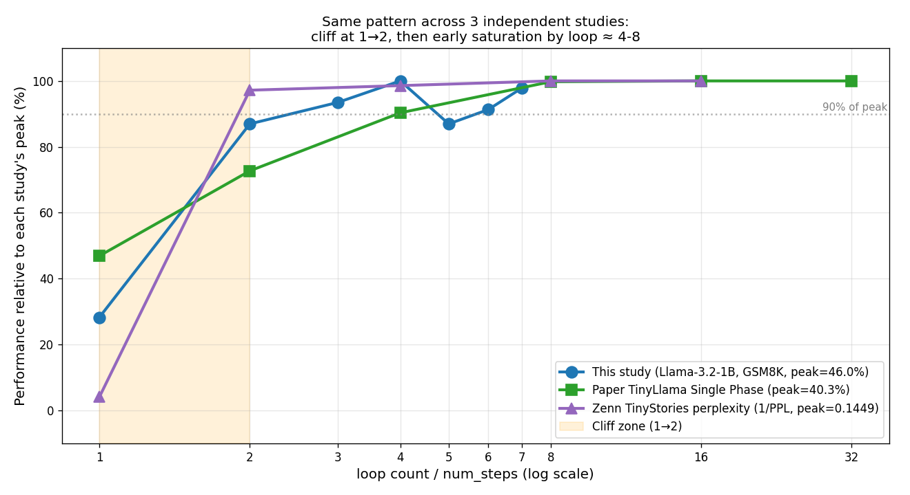

# Recurrent-Depth Transformer 実機検証コード（GSM8K 1〜7 ループ）

[arXiv:2511.07384 *Teaching Pretrained Language Models to Think Deeper with Retrofitted Recurrence*](https://arxiv.org/abs/2511.07384) で公開された **`smcleish/Recurrent-Llama-3.2-train-recurrence-16`** を、推論時のループ数 `num_steps` を 1〜7 で1刻みスイープし、GSM8K 100問で評価したコード一式です。

📝 **記事**：[OpenMythos は SLM の業務利用に道を開いたのか？](https://qiita.com/...) <!-- TODO: Qiita URL を投稿後に更新 -->

## 主要な発見（要約）

- 1→2 ループで accuracy が 13% → 40% と崖
- 4ループでピーク 46.0%、5,6,7 で 40-45% の範囲で揺れるだけ（早期飽和）
- 論文 Appendix Table 6 の TinyLlama Single Phase でも 8ループ以降は40.2 → 40.3 → 40.3 で完全フラット
- 3独立検証（本検証 / 論文 / Zenn TinyStories）で同一パターン

詳細は記事を参照してください。

## 結果スナップショット



| num_steps | Local accuracy (M2 Pro) | Colab accuracy (T4) |
|---:|---:|---:|
| 1 | 13.0% | 13.0% |
| 2 | 40.0% | 40.0% |
| 3 | 43.0% | 44.0% |
| 4 | **46.0%** | 45.0% |
| 5 | 40.0% | – |
| 6 | 42.0% | – |
| 7 | 45.0% | – |

## 構成

```
.
├── eval_gsm8k.py              # 主評価スクリプト (num_steps=1,2,3,4)
├── eval_gsm8k_extra.py        # 追加評価 (num_steps=5,6,7)
├── aggregate_and_plot.py      # 集計・グラフ生成
├── plot_three_studies.py      # 3独立検証統合プロット
├── requirements.txt           # 依存パッケージ
├── results/                   # ローカル評価の生 JSON (1〜7)
├── results_colab/             # Colab 評価の生 JSON (1〜4)
├── colab/                     # Colab 用 notebook 一式
│   ├── Recurrent_Llama_GSM8K_eval.ipynb
│   ├── README_colab.md
│   └── eval_colab.py
├── plot.png                   # メイン比較プロット
├── plot_marginal.png          # マージナル改善プロット
├── plot_three_studies.png     # 3独立検証 (絶対値、subplot)
├── plot_three_studies_normalized.png  # 3独立検証 (正規化、本記事核心)
├── LICENSE                    # Apache-2.0
└── README.md                  # 本ファイル
```

## 必要環境

| 項目 | バージョン |
|---|---|
| Python | 3.10+（検証は 3.13.1）|
| PyTorch | 2.4+（検証は 2.11.0）|
| transformers | **4.46.3**（5.x は非互換） |
| GPU | M2 Pro 16-32GB / Tesla T4 / 同等品で動作確認 |
| ディスク | 約 4GB（モデル重み）|

## 再現手順（Apple Silicon 例）

```bash
# 1. 環境構築
python3 -m venv .venv
source .venv/bin/activate
pip install -r requirements.txt

# 2. 動作確認（任意）
python smoke_test.py            # 開発時用、リポジトリには非含

# 3. 主評価（num_steps = 1, 2, 3, 4）
python eval_gsm8k.py            # M2 Pro で約 1-1.5 時間

# 4. 追加評価（num_steps = 5, 6, 7）
python eval_gsm8k_extra.py      # M2 Pro で約 1 時間

# 5. 集計・グラフ生成
python aggregate_and_plot.py
python plot_three_studies.py
```

## Colab T4（無料枠）での再現手順

1. `colab/Recurrent_Llama_GSM8K_eval.ipynb` を [Google Colab](https://colab.research.google.com/) にアップロード
2. ランタイム→タイプ変更→T4 GPU
3. 上から順にセル実行
4. 約 30-60 分で完走、最後に `results_colab.zip` がダウンロード

詳細は `colab/README_colab.md` 参照。

## 主要な実装ポイント

### `num_steps` の指定方法

```python
out = model.generate(
    input_ids,
    max_new_tokens=160,
    do_sample=False,
    num_steps=4,   # 推論時のループ回数
    pad_token_id=tokenizer.eos_token_id,
)
```

### 4-shot CoT プロンプト + 早期停止

`\nQuestion:` 検出で停止する `StoppingCriteria` を使用し、無駄な続きの生成を防いでいます。詳細は `eval_gsm8k.py` 参照。

## ライセンス

[Apache License 2.0](LICENSE)

依拠する重みは [smcleish/Recurrent-Llama-3.2-train-recurrence-16](https://huggingface.co/smcleish/Recurrent-Llama-3.2-train-recurrence-16) で、これも Apache-2.0 です。

## 関連リソース

- 論文：[arXiv:2511.07384](https://arxiv.org/abs/2511.07384)
- 論文コード：[mcleish7/retrofitting-recurrence](https://github.com/mcleish7/retrofitting-recurrence)
- 訓練済み重み：[tomg-group-umd/retrofitting-recurrence (HuggingFace)](https://huggingface.co/collections/tomg-group-umd/retrofitting-recurrence)
- 関連OSS：[OpenMythos (kyegomez/OpenMythos)](https://github.com/kyegomez/OpenMythos)
- 先行検証：[seeda_yuto 氏「話題のClaude Mythosを自作してRTX 4080で検証したら…」 (Zenn)](https://zenn.dev/seeda_yuto/articles/open-mythos-recurrent-depth-benchmark)

## 引用

本検証を引用される場合：

```
@misc{kiwiiosarujp2026recurrentllamaeval,
  author = {kiwiiosaru-jp},
  title  = {Recurrent-Depth Transformer 実機検証コード（GSM8K 1〜7 ループ）},
  year   = {2026},
  url    = {https://github.com/kiwiiosaru-jp/recurrent-llama-eval}
}
```
