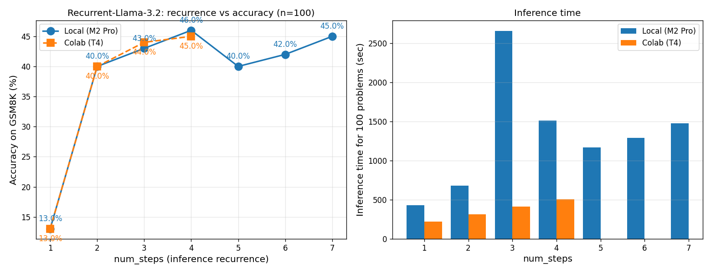

# Recurrent-Llama-3.2 GSM8K 100問評価レポート

**モデル**: smcleish/Recurrent-Llama-3.2-train-recurrence-16  
**評価データ**: GSM8K test 先頭100問  
**プロンプト**: 4-shot CoT (lm-eval-harness 風)  
**生成設定**: greedy, max_new_tokens=160, stop on '\nQuestion:'

## 結果サマリ

### ローカル (M2 Pro / MPS / fp16)

| num_steps | accuracy | 正答数 | 経過時間 |
|---:|---:|---:|---:|
| 1 | 13.0% | 13/100 | 432.5s |
| 2 | 40.0% | 40/100 | 679.8s |
| 3 | 43.0% | 43/100 | 2658.5s |
| 4 | 46.0% | 46/100 | 1510.4s |
| 5 | 40.0% | 40/100 | 1166.2s |
| 6 | 42.0% | 42/100 | 1291.8s |
| 7 | 45.0% | 45/100 | 1475.3s |

### Colab (T4 / fp16)

| num_steps | accuracy | 正答数 | 経過時間 |
|---:|---:|---:|---:|
| 1 | 13.0% | 13/100 | 219.1s |
| 2 | 40.0% | 40/100 | 314.8s |
| 3 | 44.0% | 44/100 | 415.4s |
| 4 | 45.0% | 45/100 | 506.8s |

## 観察

- num_steps=1 → 7 で accuracy が 13.0% → 45.0% (+32.0pt)
- **論文の主張通り、ループ増で精度が向上する傾向**

## 「最少ループでは外したが最多ループで正解した」例

### 問題 #0

**Q**: Janet’s ducks lay 16 eggs per day. She eats three for breakfast every morning and bakes muffins for her friends every day with four. She sells the remainder at the farmers' market daily for $2 per fresh duck egg. How much in dollars does she make every day at the farmers' market?

**正解**: 18

- num_steps=1 の予測: `26` ❌
- num_steps=7 の予測: `18` ✅

### 問題 #3

**Q**: James decides to run 3 sprints 3 times a week.  He runs 60 meters each sprint.  How many total meters does he run a week?

**正解**: 540

- num_steps=1 の予測: `180` ❌
- num_steps=7 の予測: `540` ✅

### 問題 #9

**Q**: Eliza's rate per hour for the first 40 hours she works each week is $10. She also receives an overtime pay of 1.2 times her regular hourly rate. If Eliza worked for 45 hours this week, how much are her earnings for this week?

**正解**: 460

- num_steps=1 の予測: `940` ❌
- num_steps=7 の予測: `460` ✅

## グラフ

